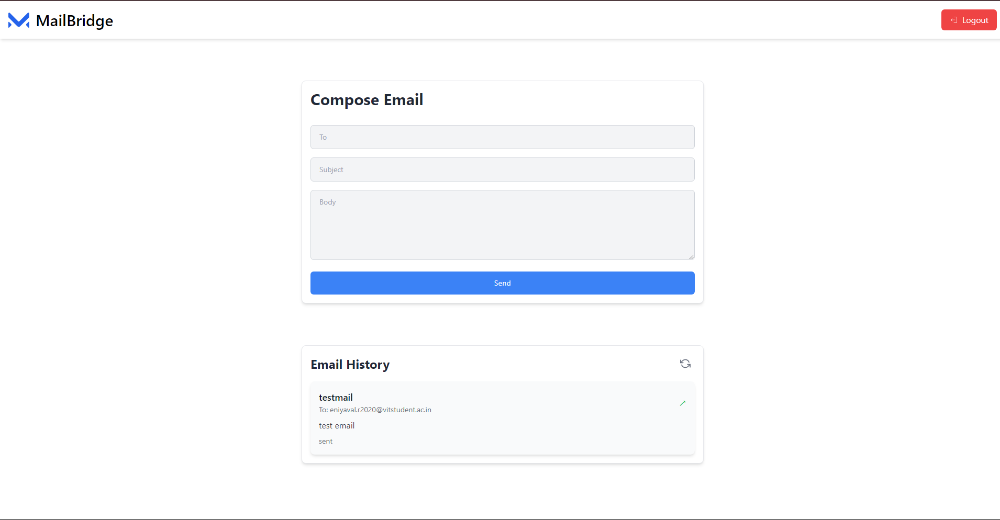

# Communication Platform SaaS Application

## Description

This project implements a communication platform within a SaaS application. Users can log in using Google OAuth, view their communication details (including sent and received emails), and interact with the Postmarkapp.com API for email communication. This assignment aims to assess skills in integrating third-party services, implementing OAuth authentication, and building a microservices architecture.



### Features

- **Backend Microservice (Node.js):**

  - User authentication via Google OAuth.
  - Endpoint to view communication history.
  - Endpoint to send emails using Postmarkapp.com API.

- **Frontend (React):**

  - Google OAuth integration for user login.
  - Display of communication history.
  - Email composition and sending functionality.
  - Integration with Postmarkapp.com for email communication.

- **Additional Features:**
  - Real-time updates of communication history.

## Table of Contents

- [Installation](#installation)
- [Usage](#usage)
- [API Endpoints](#api-endpoints)
- [Technologies Used](#technologies-used)
- [Contributing](#contributing)

## Installation

1. **Clone the repository:**

   ```bash
   git clone https://github.com/Eniyaval92/tensorgo-assignment.git
   cd tensorgo-assignment
   ```

2. **Install dependencies:**

   ```bash
   npm install
   ```

3. **Set up environment variables:**

   Create a `.env` file in the root directory and add the following variables:

   ```env
   PORT=5000
   MONGO_URI=YOUR_MONGO_URI
   JWT_SECRET=your_jwt_secret_key
   GOOGLE_CLIENT_ID=your_google_client_id
   GOOGLE_CLIENT_SECRET=your_google_client_secret
   POSTMARK_SERVER_TOKEN=your_postmark_server_token
   FROM_EMAIL=FROM_EMAI_FROM_POSTMARK
   PORT=5000
   ```

   - `PORT`: Port number for the Node.js server.
   - `MONGO_URI`: MongoDB connection URI.
   - `JWT_SECRET`: Secret key for JWT token encryption.
   - `GOOGLE_CLIENT_ID` and `GOOGLE_CLIENT_SECRET`: OAuth credentials for Google authentication.
   - `POSTMARK_SERVER_TOKEN`: API token for Postmarkapp.com.

4. **Run the server:**

   ```bash
   cd backend
   npm install
   npm start
   ```

5. **Run the client (React frontend):**

   Open a new terminal tab/window:

   ```bash
   cd frontend
   npm install
   npm start
   ```

   The React app should now be running on `http://localhost:3000`.

## Usage

1. **Authentication:**

   - Navigate to `http://localhost:3000`.
   - Click on the "Login with Google" button to authenticate via Google OAuth.

2. **Communication History:**

   - After logging in, the user can view their communication history, including sent and received emails.

3. **Compose and Send Email:**

   - Use the provided interface to compose and send emails.

## API Endpoints

### `/auth`

- `GET /auth/google`: Initiates Google OAuth authentication.

### `/api`

- `GET /api/history`: Retrieves user's communication history.
- `POST /api/send`: Sends an email using Postmarkapp.com API.

## Technologies Used

- Node.js
- Express.js
- MongoDB
- React
- Postmarkapp.com API
- JWT (JSON Web Tokens)
- Axios (for HTTP requests)
- Passport.js (for OAuth authentication)

## Contributing

Contributions are welcome! Please follow these steps to contribute:

1. Fork the repository.
2. Create a new branch (`git checkout -b feature/awesome-feature`).
3. Make your changes.
4. Commit your changes (`git commit -am 'Add awesome feature'`).
5. Push to the branch (`git push origin feature/awesome-feature`).
6. Create a new Pull Request.
